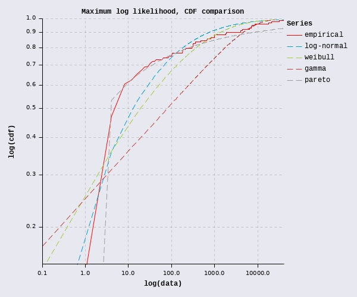
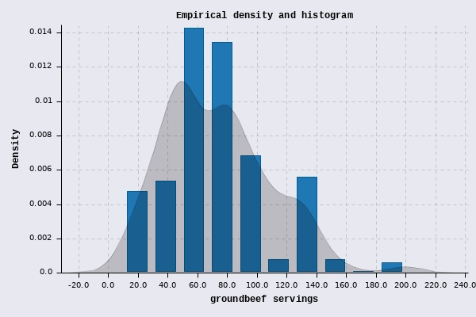
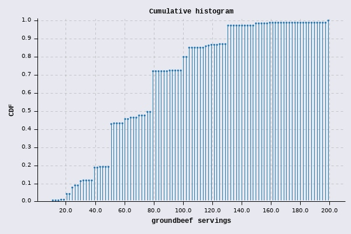
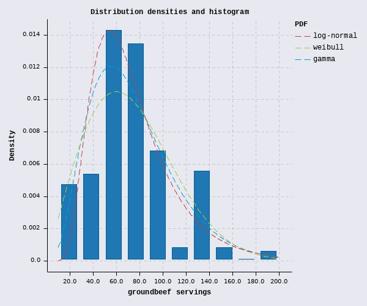
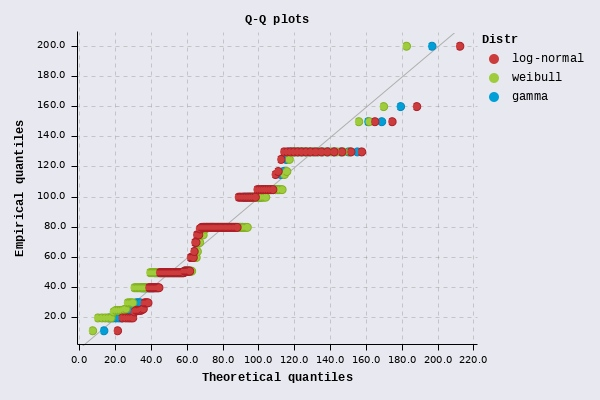
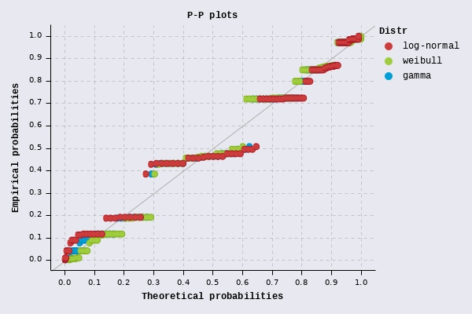
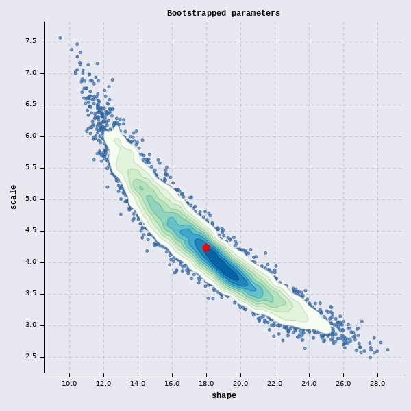
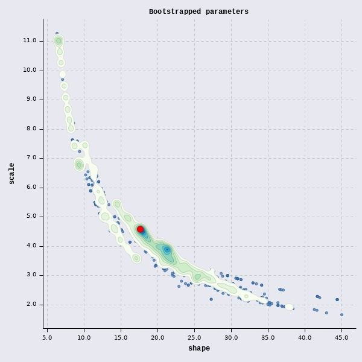

# Distribution Fitting in Clojure

`[generateme/fitdistr "0.0.1-SNAPSHOT"]`

Library provides the set of functions to fit univariate distribution to your (uncensored) data.

Entry point: `fit` function with supported methods:

* Maximum log likelihood estimation - `:mle`
* Maximum goodness-of-fit estimation:
    * Kolmogorov-Smirnov - `:ks`
    * Cramer-von-Mises - `:cvm`
    * Anderson-Darling - `:ad`
* Quantile matching estimation - `:qme`

Additionally you can use:

* `bootstrap` to generate parameters from set of resampled data
* `infer` to generate parameters computationally from data

Library is highly based on [fitdistrplus](https://cran.r-project.org/web/packages/fitdistrplus/index.html) R package.

For details please read [this paper](https://cran.r-project.org/web/packages/fitdistrplus/vignettes/paper2JSS.pdf).

[fastmath](https://github.com/generateme/fastmath) distributions and optimization methods are used here.

## How does it work?

For every method target function is created which accepts distribution parameters and returns log-likelihood, MSE/MAE of quantiles or differences between cdfs. Such function is minimized or maximized using one of available algorithms (gradient based or simplex based). Optimization is bounded. Initial values for optimization are infered from data.

For bootstrap, sequences of resampled data are created and then each sequence is fitted. Best result (mean or median) is used as a final parametrization. Additionally confidence interval (or other ranges like irq or min-max) is returned.

Values of the any target function can be calculated and returned as fitness measure.

## Usage

To run inference just call one of the following functions:

* `(fit method distribution data params)`
* `(bootstrap method distribution data params)`
* `(infer distribution data params)`

where:

* `method` - one of supported methods as a keyword (like: `:mle` or `:qme`)
* `distribution` - a name of the distribution as keywords (see below) (like: `:beta`)
* `data` - any `sequable` of numbers
* `params` - parametrization (optional, see below)

All methods return map with following keys:

* `:params` - best parametrization 
* `:distribution` - distribution object
* `:distribution-name` - name of the distribution
* `:method` - used fitting method
* `:stats` - statistics (see below)

For bootstrap you receive additionally:

* `:ci` - confidence interval (several methods, see below)
* `:ci-type` - name of the interval method
* `:all-params` - (optional) list of parameters for each resampled dataset
* `:params` - best parametrization (mean or median, depending on confidence interval)

Some validations on data and initial parameters are made.

### Example 1

Proof that matching is accurate enough

```clojure
(def target (r/->seq (r/distribution :weibull {:alpha 0.5 :beta 2.2}) 10000))

(fit :ad :weibull target {:stats [:mle]})
;; => {:stats
;;     {:ad 0.19749431207310408,
;;      :mle -19126.212671469282,
;;      :aic 38256.425342938564,
;;      :bic 38270.84602368252},
;;     :params {:alpha 0.5014214878565807, :beta 2.203213102262515},
;;     :distribution-name :weibull,
;;     :distribution #object[org.apache.commons.math3.distribution.WeibullDistribution 0x430997b7 "org.apache.commons.math3.distribution.WeibullDistribution@430997b7"],
;;     :method :ad}

(bootstrap :mle :weibull target {:stats #{:ad}
                                :optimizer :nelder-mead})

;; => {:stats
;;     {:mle -19126.178345014738,
;;      :ad 0.35561024021990306,
;;      :aic 38256.356690029475,
;;      :bic 38270.77737077343},
;;     :mad-median
;;     {:alpha [0.4910043451070347 0.5056336146263343 0.4983189798666845],
;;      :beta [2.1185018316179285 2.326029409552982 2.222265620585455]},
;;     :params {:alpha 0.4983189798666845, :beta 2.222265620585455},
;;     :distribution-name :weibull,
;;     :distribution #object[org.apache.commons.math3.distribution.WeibullDistribution 0x63a766b9 "org.apache.commons.math3.distribution.WeibullDistribution@63a766b9"]}

(infer :weibull target {:stats #{:mle :ad}})
;; => {:stats
;;     {:mle -19126.13369575803,
;;      :ad 0.22838225327177497,
;;      :aic 38256.26739151606,
;;      :bic 38270.68807226002},
;;     :params {:alpha 0.5012938746206328, :beta 2.215448048490149},
;;     :distribution-name :weibull,
;;     :distribution #object[org.apache.commons.math3.distribution.WeibullDistribution 0x3a0f2314 "org.apache.commons.math3.distribution.WeibullDistribution@3a0f2314"]}
```

### Example 2

Search for the best distribution and its parameters. Look at last example where Pareto distribution is wrongly considered best when using inadequate method.

```clojure
(def atv [0.6 2.8 182.2 0.8 478.0 1.1 215.0 0.7 7.9 316.2 0.2 17780.0 7.8 100.0 0.9 180.0 0.3 300.9
          0.6 17.5 10.0 0.1 5.8 87.7 4.1 3.5 4.9 7060.0 0.2 360.0 100.8 2.3 12.3 40.0 2.3 0.1
          2.7 2.2 0.4 2.6 0.2 1.0 7.3 3.2 0.8 1.2 33.7 14.0 21.4 7.7 1.0 1.9 0.7 12.6
          3.2 7.3 4.9 4000.0 2.5 6.7 3.0 63.0 6.0 1.6 10.1 1.2 1.5 1.2 30.0 3.2 3.5 1.2
          0.2 1.9 0.7 17.0 2.8 4.8 1.3 3.7 0.2 1.8 2.6 5.9 2.6 6.3 1.4 0.8 670.0 810.0
          1890.0 1800.0 8500.0 21000.0 31.0 20.5 4370.0 1000.0 39891.8
          316.2 6400.0 1000.0 7400.0 31622.8])

(defn find-best
  [method ds]
  (let [selector (if (= method :mle) last first)]
    (dissoc (->> (map #(fit method % atv {:stats #{:mle :ad :ks :cvm}}) ds)
                 (sort-by (comp method :stats))
                 (selector))
            :distribution)))

(find-best :mle [:weibull :log-normal :gamma :exponential :normal :pareto])
;; => {:stats
;;     {:mle -532.4052019871922,
;;      :cvm 0.6373592936482382,
;;      :ks 0.1672497620724005,
;;      :ad 3.4721179220009617,
;;      :aic 1068.8104039743844,
;;      :bic 1074.0991857726672},
;;     :params {:scale 2.553816262077493, :shape 3.147240361221695},
;;     :distribution-name :log-normal,
;;     :method :mle}

(find-best :ad [:weibull :log-normal :gamma :exponential :normal :pareto])
;; => {:stats
;;     {:ad 3.0345123029861156,
;;      :cvm 0.4615381958965107,
;;      :ks 0.1332827771382316,
;;      :mle -532.9364810533066,
;;      :aic 1069.8729621066132,
;;      :bic 1075.161743904896},
;;     :params {:scale 2.2941800698596815, :shape 3.2934516278879205},
;;     :distribution-name :log-normal,
;;     :method :ad}

(find-best :ks [:weibull :log-normal :gamma :exponential :normal :pareto])
;; => {:stats
;;     {:ks 0.07692307692307693,
;;      :cvm 0.11739378941793886,
;;      :mle ##-Inf,
;;      :ad ##Inf,
;;      :aic ##Inf,
;;      :bic ##Inf},
;;     :params {:scale 0.36510648416477365, :shape 0.2649915952623174},
;;     :distribution-name :pareto,
;;     :method :ks}
```



### Example 3

This is example from the paper mentioned above (chapter 2).

Here, we try to match three distributions and using `qme` method.

```clojure
(def gb [30.0 10.0 20.0 24.0 20.0 24.0 40.0 20.0 50.0 30.0 26.0 44.0 25.0 20.0 40.0 100.0 30.0 80.0 50.0 40.0 20.0 50.0 50.0 50.0
         50.0 80.0 80.0 20.0 60.0 50.0 50.0 50.0 50.0 60.0 50.0 50.0 50.0 50.0 17.0 120.0 80.0 100.0 80.0 100.0 50.0 70.0 50.0 50.0
         50.0 30.0 90.0 125.0 50.0 25.0 50.0 75.0 100.0 60.0 100.0 11.5 100.0 100.0 50.0 40.0 50.0 50.0 50.0 150.0 50.0 80.0 100.0 100.0
         80.0 20.0 30.0 100.0 70.0 100.0 80.0 80.0 50.0 50.0 50.0 70.0 25.0 40.0 100.0 25.0 130.0 100.0 60.0 60.0 100.0 50.0 50.0 50.0
         50.0 50.0 50.0 100.0 30.0 50.0 50.0 50.0 100.0 50.0 50.0 75.0 25.0 20.0 75.0 50.0 50.0 100.0 100.0 80.0 130.0 200.0 40.0 64.0
         40.0 80.0 80.0 79.0 80.0 105.0 51.0 130.0 105.0 105.0 80.0 80.0 40.0 40.0 50.0 105.0 105.0 80.0 105.0 40.0 50.0 130.0 105.0 80.0
         40.0 80.0 50.0 100.0 200.0 79.0 150.0 80.0 80.0 80.0 80.0 80.0 65.0 130.0 40.0 80.0 80.0 80.0 130.0 51.0 130.0 80.0 80.0 130.0
         51.0 25.0 79.0 80.0 50.0 51.0 50.0 105.0 80.0 80.0 130.0 130.0 80.0 51.0 50.0 130.0 115.0 115.0 200.0 160.0 105.0 80.0 80.0 80.0
         130.0 130.0 80.0 51.0 50.0 130.0 105.0 105.0 80.0 105.0 80.0 60.0 51.0 105.0 80.0 51.0 40.0 130.0 130.0 40.0 32.0 80.0 25.0 80.0
         80.0 80.0 40.0 130.0 130.0 40.0 75.0 40.0 80.0 80.0 150.0 52.5 130.0 80.0 80.0 75.0 40.0 25.5 51.0 50.0 80.0 51.0 130.0 130.0
         51.0 130.0 80.0 130.0 80.0 130.0 130.0 25.5 117.0 130.0 80.0 80.0 80.0 80.0])

```

Histgram with density and cumulative histogram for data.





```clojure
(fit :qme :gamma gb {:stats [:mle]})
;; => {:stats
;;     {:qme 45.41350132338318,
;;      :mle -1253.652887342403,
;;      :aic 2511.305774684806,
;;      :bic 2518.3804432188426},
;;     :params {:scale 18.58013425207939, :shape 3.992585123164037},
;;     :distribution-name :gamma,
;;     :method :qme}

(fit :qme :weibull gb {:stats [:mle]})
;; => {:stats
;;     {:qme 52.75300844658587,
;;      :mle -1256.1208259372665,
;;      :aic 2516.241651874533,
;;      :bic 2523.3163204085704},
;;     :params {:alpha 2.052173279173565, :beta 83.1667239954531},
;;     :distribution-name :weibull,
;;     :method :qme}

(fit :qme :log-normal gb {:stats [:mle]})
;; => {:stats
;;     {:qme 58.022608223760685,
;;      :mle -1267.6351159421142,
;;      :aic 2539.2702318842285,
;;      :bic 2546.3449004182658},
;;     :params {:scale 4.204520160089395, :shape 0.46585471421274693},
;;     :distribution-name :log-normal,
;;     :method :qme}
```

Looks that `gamma` is the best.
Let's see some plots:





### Examples 4

Bootstrap groundbeef data.

```clojure
(def b-gamma (f/bootstrap :qme :gamma gb {:all-params? true
                                          :ci-type :min-max-mean
                                          :size 10000
                                          :samples 100}))

(count (:all-params b-gamma))
;; => 10000

(:min-max-mean b-gamma)
;; => {:scale [9.436000626775108 28.586945660073017 17.967024829900268],
;;     :shape [2.5005015188673814 7.565181039020107 4.238506386828045]}
```



When low number of quantiles are used, different parameters are infered.

```clojure
(def b-gamma-lowq (f/bootstrap :qme :gamma gb {:all-params? true
                                               :quantiles 3
                                               :size 10000
                                               :samples 100}))
```



### Distributions

A couple of words about distributions. All of them are backed by Apache Commons Math and SMILE libraries. They implement [DistributionProto](https://generateme.github.io/fastmath/fastmath.random.html#var-DistributionProto) with following methods:

* `pdf` - density
* `cdf` - cumulative density
* `icdf` - inversed cumulative density or quantile
* `probability` - pdf for continuous and probability for discrete densities
* `sample` - random value from distribution

Parameter names for given distribution match mostly Apache Commons Math scheme and can differ from other sources (like Wikipedia or R). The list of supported distributions can be obtained by calling:

```clojure
(sort (keys (methods fitdistr.distributions/distribution-data)))
;; => (:beta :exponential :gamma :geometric :log-normal :negative-binomial :normal :pareto :poisson :weibull)
```
The list of distribution parameters can be checked by calling `(:param-names (fitdistr.distributions/distribution-data :weibull))`

Please refer [Apache Commons Math API](https://commons.apache.org/proper/commons-math/javadocs/api-3.6.1/org/apache/commons/math3/distribution/package-summary.html) for all details.

### Optimization methods

For `fit` and `bootstrap` functions parameter optimization is used to minimize or maximize underlying target function..

Set `:optimizer` to select optimizer. Optimizer tuning is possible by setting parameters listed below.

* `:gradient`
    * `:gradient-size` - step size `h` in two-point finite difference formula used to calculate gradient
    * `:formula` - `:polak-riberie` (default) or `:fletcher-reeves`
* `:nelder-mead` (default)
    * `:rho`, `:khi`, `:gamma`, `:sigma`
    * `:side-length`
* `:multidirectional-simplex`
    * `:rho`, `:khi`, `:gamma`
    * `:side-length`
* `:cmaes` - often problem with convergence
    * `:active-cma?` (true)
    * `:diagonal-only`
    * `:check-feasable-count`
    * `:stop-fitness`
    * `:population-size`
* `:bobyqa` - not satisfying results
    * `:number-of-points`
    * `:initial-radius`
    * `:stopping-radius`
* `:powell` - also not statisfying

Parameters common to all optimizers.

* `:rel` and `:abs` for relative and absolute accuracy
* `:max-evals` for maximum number of function evaluation (default: no limit)
* `:max-iters` for maximum number of iterations (default: 1000)

Please refer [Apache Commons Math API](https://commons.apache.org/proper/commons-math/javadocs/api-3.6/org/apache/commons/math3/optim/package-summary.html) for details.

### Parametrization

When calling fitting method you can provide additional parameters which are. All are optional.

* `:stats` - set of requested fitting function values, the same as fitting methods, default: same as method or `:mle`
* `:initial` - vector of inital values for parameters, default: infered from data
* `:quantiles` for `:qme` - sequence of quantiles to match or number of quantiles (evenly distributed between 0 and 1), default: 50
* `:strategy` for `:qme` - quantile estimation strategy, one of `:legacy` `:r1` `:r2` `:r3` `:r4` `:r5` `:r6` `:r7` `:r8` `:r9`, default `:legacy`
* `:qmeasure` for `:qme` - method of difference measurement, `:mse` (mean squared error) or `:mae` (mean absolute error), default `:mse`
* `:optimizer` - as above, default: `:nelder-mead`
* optimizer parameters - as above
* `:size` for `bootstrap` - number of resampled data, default: 100
* `:samples` for `bootstrap` - number of samples in sequence, default: 10% of data, minimum 100, maximum 5000 samples
* `:ci-type` for `bootstrap` - interval type (see below), default: `:mad-median`
* `:all-params?` for `bootstrap` - return list of parameters for each resampled sequence, default: `false`

#### CI

`bootstrap` generates sequence of parameters and they are also follows some distribution. Library provides various methods to analyze parameters from resampled data. `bootstrap` returns three values under `:ci` key: `[left,right,center]` where: `left` and `right` form interval and `center` is given statistic (mean or median). Following intervals are possible:

* `:stddev-mean` - standard deviation and mean
* `:mad-median` - median absolute deviation and median
* `:sem-mean` - standard error of mean and mean
* `:iqr-median` - IQR and median
* `:adj-median` - adjacent values and median
* `:ci` - confidence interval based on Student's t-distribution and mean
* `:min-max-mean` - minimum, maximum values and mean

Example: values of each type for 10000 samples from N(0,1)

```clojure
{:stddev-mean  (-0.9922 1.0016 0.0047)
 :mad-median   (-0.6564 0.6762 0.0099)
 :sem-mean     (-0.0053 0.0147 0.0047)
 :iqr-median   (-0.663 0.6699 0.0099)
 :adj-median   (-0.6564 0.6762 0.0099)
 :ci           (-0.0185 0.0279 0.0047)
 :min-max-mean (-3.9825 4.7877 0.0047)}
```

### Known issues

- `:ad` in `mge` may converge slow
- sometimes convergence fails (for example `:gradient` on Pareto distribution using `:ad` method)
- `:levy` requires `:gradient` optimizer to converge
- `infer` doesn't return proper parameters in some cases for `:f`, `:nakagami`, `:levy`

### TODO

- more distributions
- all `mge` methods (ADR, ADL, AD2R, AD2L, AD2) from fitdistrplus
- more statistics (which?)

## License

Copyright © 2019 GenerateMe

This program and the accompanying materials are made available under the
terms of the Eclipse Public License 2.0 which is available at
http://www.eclipse.org/legal/epl-2.0.

This Source Code may also be made available under the following Secondary
Licenses when the conditions for such availability set forth in the Eclipse
Public License, v. 2.0 are satisfied: GNU General Public License as published by
the Free Software Foundation, either version 2 of the License, or (at your
option) any later version, with the GNU Classpath Exception which is available
at https://www.gnu.org/software/classpath/license.html.
